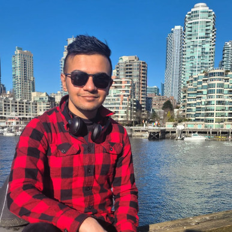
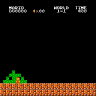
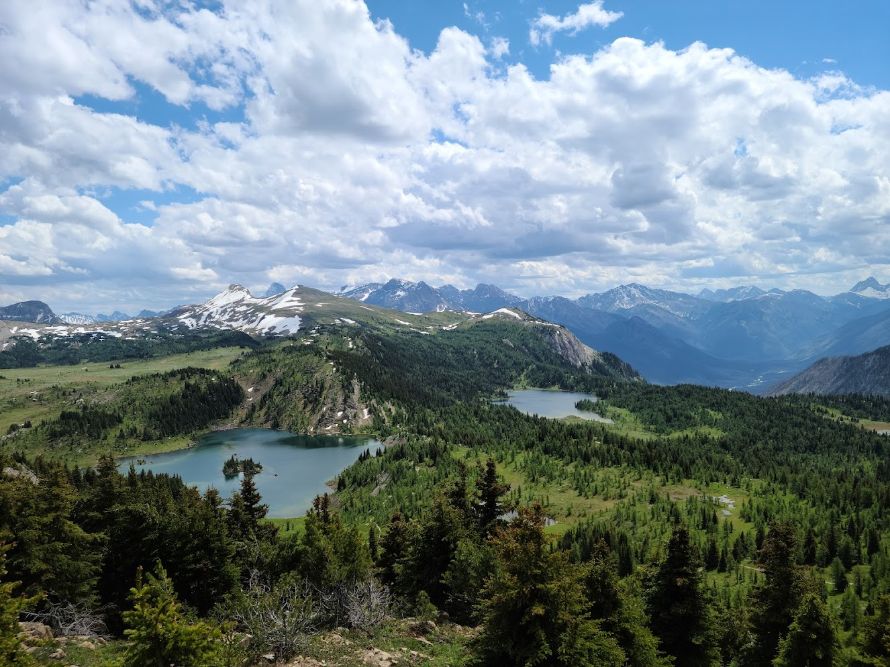
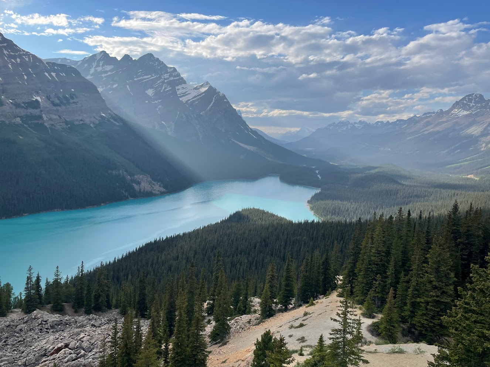
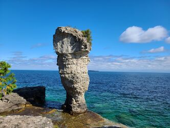
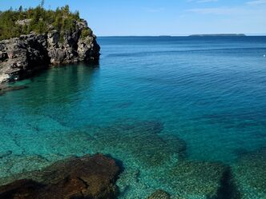
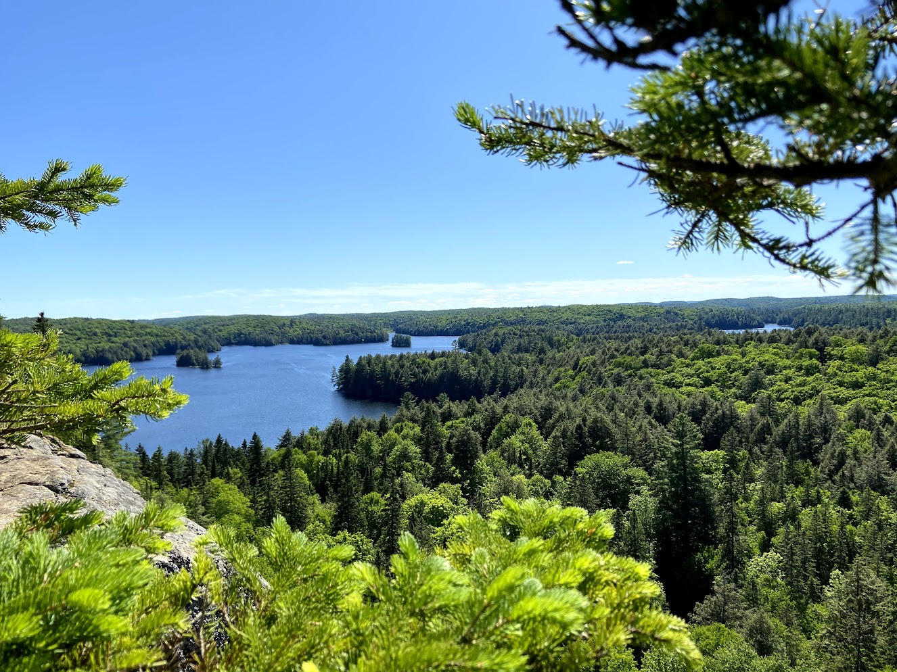

I am a computer science researcher whose interests lie primarily in the Systems domain. I have been a part of projects in Cloud Computing, Distributed Systems and Computer Architecture. My current research is focused on the following areas:
  - Utilizing recent advances such as _RDMA_ and _Programmable Switches (P4)_ to accelerate large-scale system performance
  - Analyzing the impact of _Networking Failures_ on large-scale software systems
  - Analysis of modern-day _Serverless Computing_ infrastructure to identify performance bottlenecks and optimization opportunities

I am enrolled in the PhD program in Computer Science at the University of Waterloo as a part of the Waterloo Advanced Systems Lab ([WASL](https://wasl.uwaterloo.ca/)). My supervisor is [Dr. Samer Al-Kiswany](https://cs.uwaterloo.ca/~alkiswan/index.html). Prior to this, I was enrolled in the research-based master's program at Waterloo from 2019-2021 and I have been a Design Engineer at Advanced Micro Devices (AMD) from 2017-2019. 

I received my master's degree in Computer Science from the University of Waterloo in 2021, working under the supervision of  [Dr. Samer Al-Kiswany](https://cs.uwaterloo.ca/~alkiswan/index.html). I received my undergraduate degree in Computer Science from PES University in Bangalore, India and have been supervised by [Dr. K.V Subramaniam](https://www.linkedin.com/in/kalsubra/?originalSubdomain=in) and [Dr. Phalachandra](https://staff.pes.edu/nm1313). I was a research assistant at [CCBD](http://research.pes.edu/cloud-computing-big-data/) during my time there.

I have experience developing systems in numerous languages such as C, C++, Java, JavaScript and Python along with limited experience in Solidity.

**Complete Resume**: [Resume](https://sreeharshau.github.io/Sreeharsha_Resume_2022.pdf)

**LinkedIn**: [Sreeharsha Udayashankar](https://www.linkedin.com/in/sreeharshau/)

## Publications

- **Orcbench: A Representative Serverless Benchmark** (IEEE Cloud 2022) - _Ryan Hancock, Sreeharsha Udayashankar, Ali Mashtizadeh and Samer Al-Kiswany_ [[Paper]](https://rcs.uwaterloo.ca/~ryan/files/orcbench.pdf)
- **Benchmarking Diferentially Private Algorithms** (TPDP - ICML 2021) - _Huiyi Ning, Sreeharsha Udayashankar, Sara Qunaibi, Karl Knopf and Xi He_ [[Paper]](https://tpdp.journalprivacyconfidentiality.org/2021/papers/NingUQKH21.pdf)
- **In-Network Scheduling for Real-Time Analytics** (MMath Thesis - 2021) - _Sreeharsha Udayashankar_ [[Thesis]](https://uwspace.uwaterloo.ca/handle/10012/16922)
- **Falcon - Low Latency Network Accelerated Scheduling** (EuroP4 - ACM CoNext 2020) - _Ibrahim Kettaneh, Sreeharsha Udayashankar, Ashraf Abdel-Hadi, Robin Grosman and Samer Al-Kiswany_ [[Paper]](https://dl.acm.org/doi/10.1145/3426744.3431322)
- **Gaming Modeling and Projections - The Impact of CPU Performance** (AMD Asia Tech Conference 2019) - _Sreeharsha Udayashankar, Saumya Chandra and Don Cherepacha_

## Side Projects

In my spare time, I like to develop applications using a variety of languages and tools to keep my skills sharp. Some of these projects and their source code are showcased in this section.

### MuZero on Super Mario Bros

I have attempted to evaluate MuZero, an algorithm for deep learning published by Google Deepmind in 2019, against Deep-Q-Networks with Double-Q-Learning, the state of the art model free algorithm. I have compared their performance using the game Super Mario Bros. The system architectural diagram has been shown below:

  

    
  

Clips of an agent trained using MuZero playing the game can be found below:

|     Training GIF 1 (_Level Complete_)  |  Training GIF 2 (_Level Complete_)  | Training GIF 3 (_Level Fail_) | Training GIF 4 (_Level Fail_) |
:-------------------------:|:-------------------------:|:-------------------------:|:-------------------------:
|  |  |  |  |

**Details**

- [Repository Link](https://github.com/sreeharshau/muzero-super-mario-bros)
- [Evaluation Report](Evaluating_MuZero_Super_Mario_Bros.pdf)

### The Crypto Lottery

This project consists of an Ethereum-based back end and a front end powered by React.js. The objective of this project was to build a lottery application where users register using Ether and stand a chance to win the Jackpot. 

The Jackpot is the prize pool consisting of contributions from all participants with the winner being chosen at regular time intervals. A participants chances also increase with the Ether they contribute up to a certain limit.
 
 

    
  

**Source Code**:

- [Crypto Lottery Frontend](https://github.com/sreeharshau/EthereumLotteryApplication_ReactUI)

- [Crypto Lottery Backend](https://github.com/sreeharshau/EthereumLottery_SmartContract)

### Python Game Collection

I have developed a few games in Python 3.6 using the PyGame library. Some of them are showcased below.

| Snake    | Memory Game    |
:-------------------------:|:-------------------------:
|  |  |

**Source Code**

 - [Snake](https://github.com/sreeharshau/snake-python)

 - [Emoji Memory Game](https://github.com/sreeharshau/memory-game-python)

## Hobbies

I enjoy running, cycling and hiking in my spare time. Here are a few images I've shot using my phone on some of my hikes:

**Canadian Hiking**

| <!-- -->    | <!-- -->    |
:-------------------------:|:-------------------------:
Sunshine Meadows - _Banff National Park_             |  Peyto Lake - _Banff National Park_
  |  
Flowerpot Island - _Bruce Peninsula National Park_ |   The Grotto - _Bruce Peninsula National Park_     
  |  
Centennial Ridges - _Algonquin Provincial Park_            |  Track and Tower - _Algonquin Provincial Park_
  |  

**Indian Hiking** 

BR Hills - _Karnataka_   |  Tadiandamol - _Karnataka_
:-------------------------:|:-------------------------:
  |  

