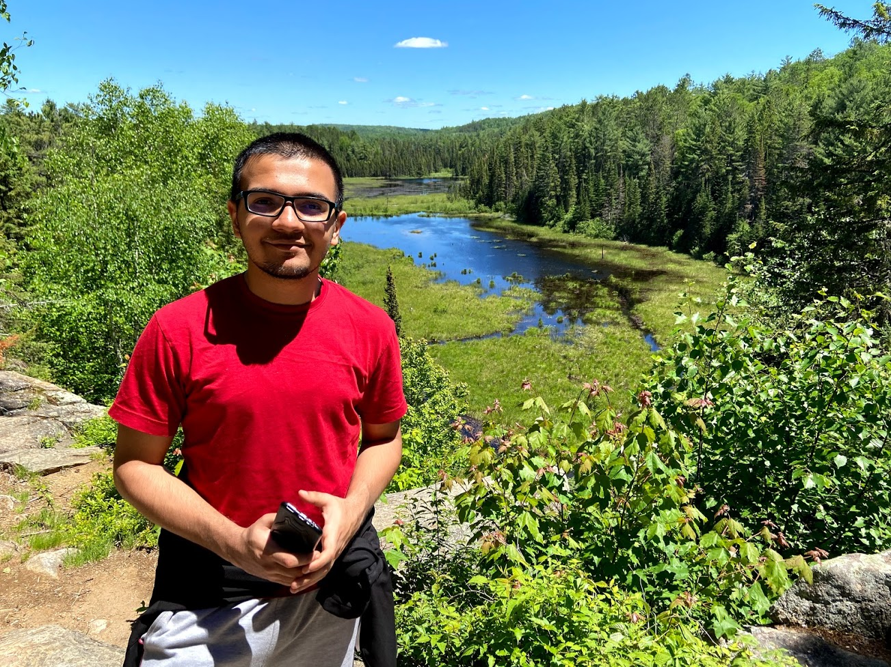
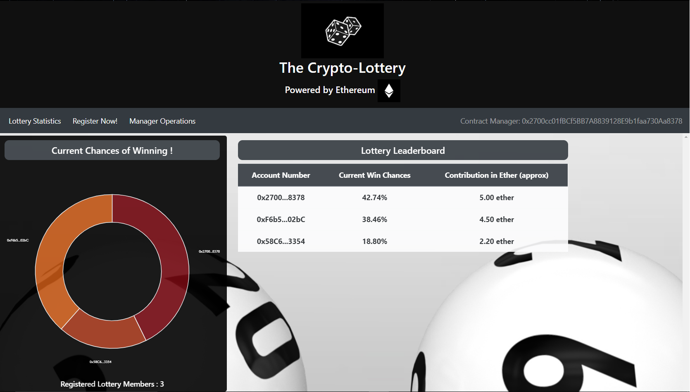
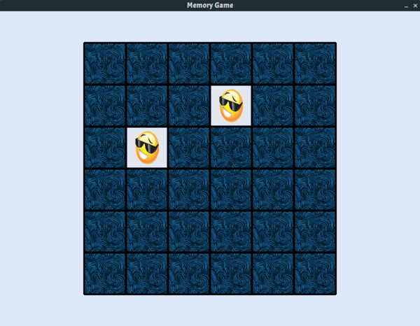

I am a computer science researcher whose interests lie primarily in the Systems domain. I have been a part of projects in Cloud Computing, Distributed Systems and Computer Architecture.My current research is focused on using the P4 programming language to aceelerate components in existing large scale systems. 

I am currently enrolled in a research based masters program in Computer Science at the University of Waterloo. I am a part of the Waterloo Advanced Systems Lab ([WASL](https://wasl.uwaterloo.ca/)) and my supervisor is [Dr. Samer Al-Kiswany](https://cs.uwaterloo.ca/~alkiswan/index.html). Prior to this, I have been a Design Engineer at Advanced Micro Devices (AMD) from 2017-2019. 

I received my undergraduate degree in Computer Science from PES University in Bangalore, India and have been supervised by [Dr. K.V Subramaniam](https://faculty.pes.edu/p10213) and [Prof. Phalachandra](https://faculty.pes.edu/p10024). I was a research assistant at [CCBD](http://research.pes.edu/cloud-computing-big-data/) during my time there.

I have experience developing systems in numerous languages such as C, C++, Java, JavaScript and Python along with limited experience in Solidity.

**Complete Resume**: [Resume](https://github.com/sreeharshau/about_me/blob/gh-pages/Sreeharsha_Resume.pdf)

**LinkedIn**: [Sreeharsha Udayashankar](https://www.linkedin.com/in/sreeharshau/)

## Publications

- **Falcon - Low Latency Network Accelerated Scheduling** (To be published in ACM EuroP4 2020) - _Ibrahim Kettaneh, Sreeharsha Udayashankar, Ashraf Abdel-Hadi and Samer Al-Kiswany_
- **Gaming Modeling and Projections - The Impact of CPU Performance** (AMD Asia Tech Conference 2019) - _Sreeharsha Udayashankar, Saumya Chandra and Don Cherepacha_

## Side Projects

In my spare time, I like to develop applications using a variety of languages and tools to keep my skills sharp. Some of these projects and their source code are showcased in this section.

### The Crypto Lottery

This project consists of an Ethereum-based back end and a front end powered by React.js. The objective of this project was to build a lottery application where users register using ether and stand a chance to win the Jackpot. 

The Jackpot is the prize pool consisting of contributions from all participants with the winner being chosen at regular time instervals. A participants chances also increase with the ether he contributes up to a certain limit.

**Source Code**:

- [Crypto Lottery Frontend](https://github.com/sreeharshau/EthereumLotteryApplication_ReactUI)

- [Crypto Lottery Backend](https://github.com/sreeharshau/EthereumLottery_SmartContract)

### The Emoji Memory Game

This project is a simple memory game using emojis. It was developed using Python 3.6 and is powered by PyGame.

**Source Code**: 
[Emoji Memory Game](https://github.com/sreeharshau/memory-game-python)

## Hobbies and other Interests

I enjoy running, cycling and hiking in my spare time. I love travelling to and experiencing new places. If there is a place you think I should visit, let me know! Here are a few images I've shot using my phone on some of my hikes:

**Algonquin Provincial Park** (_Ontario, Canada_)

B.R. Hills (_Karnataka, India_)

**Tadiandamol** (_Karnataka, India_)

**Dhauladhar Range** (_Himachal Pradesh, India)

